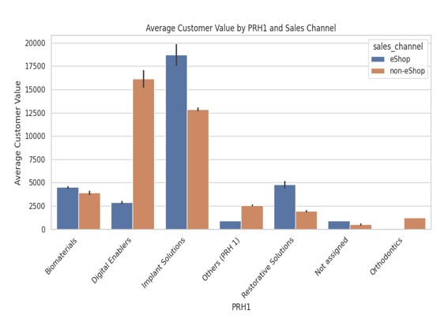
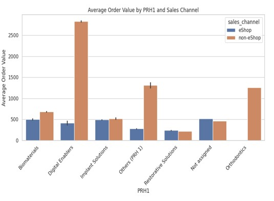
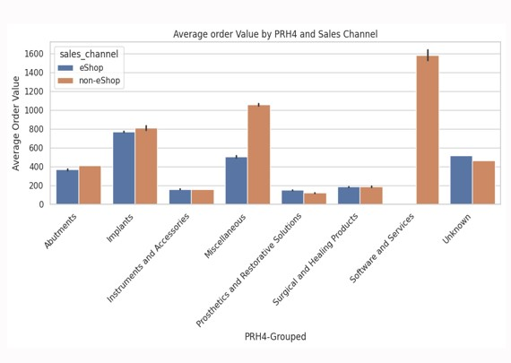
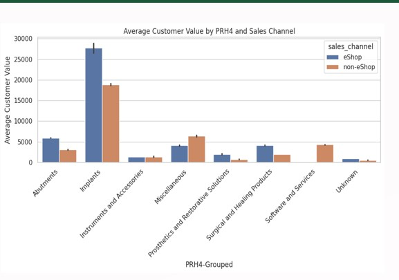
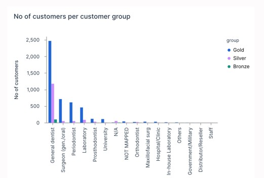
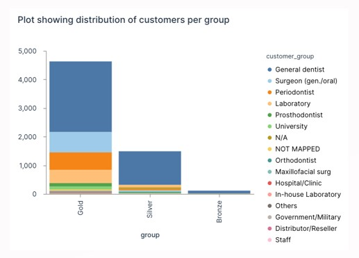
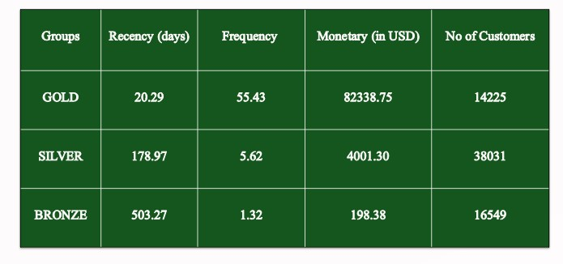
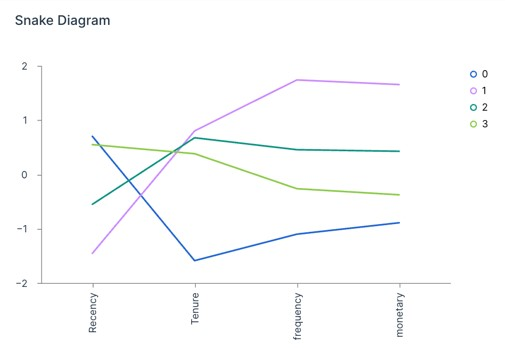
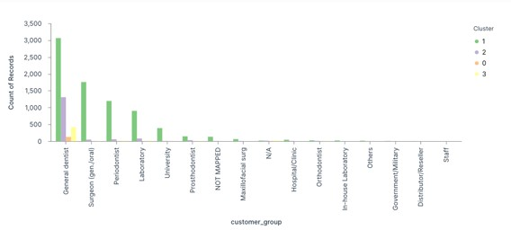
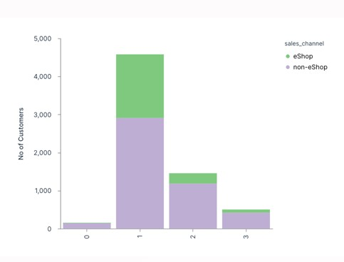

# Customer Segmentation & Predictive Modeling for Product Buying Patterns

This project aims to delve deep into the purchasing behavior of Straumann's customers. The primary objectives include:
### Identification of Buying Patterns: 
Understand and classify the purchasing behavior of customers by analyzing past transaction data. This involves identifying products frequently bought together and determining typical customer preferences.
### Predictive Modeling: 
Develop advanced data models to predict future buying behaviors. These models will not only forecast what products customers are likely to purchase but also suggest complementary products that could be bundled or recommended.
### Actionable Insights for Marketing:
Provide insights that allow the marketing team to target customers more effectively with tailored campaigns. The aim is to boost the success of cross-selling and up-selling strategies by focusing on the right products for the right customers.

## About Sponsor

[Starumann USA LLC ](https://www.straumann.com/us/en/dental-professionals.html), a leading name in esthetic dentistry, is at the forefront of revolutionizing oral health care by providing products that significantly enhance the quality of life. The company believes in the transformative power of a smile, not just as a reflection of physical well-being but as a catalyst for improving self-confidence and unlocking personal potential. In its quest to continuously innovate and serve its customer base better, Straumann is focusing on leveraging data analytics to understand and predict customer behavior more effectively.
## Tech Stack

**Skills** Data cleaning , Data processing ,K-means Clustering
**Programming Language:** Python, pandas 

**Methodologies used :** Clustering , RFM analysis , Cohort analysis, market basket analysis

## Dataset Description 
* order_date
* order_number  
* material_number
* order_material_net_value
* sales_channel    
* PRH1 
* PRH4  
* customer_group
* customer_number 
* region
* DSO_Ind 

The dataset contains 3167194 rows and 11 columns 

## EDA

## Cohort analysis

The analysis reveals that eShop customers have a significantly higher retention rate compared to non-eShop customers. This insight underscores the importance of the eShop channel in maintaining customer engagement and loyalty.

## RFM analysis

## Clustering using K-Means

We identified four customer clusters, which are visually represented in the snake diagram. Below diagram shows the variation in RFM values for each cluster type. Cluster 1 emerged as the prime customer group, characterized by the lowest recency values and the highest frequency, tenure, and monetary values. Conversely, Cluster 0 was identified as the least profitable group, with the highest recency values and the lowest tenure, frequency, and monetary values. Clusters 2 and 3 exhibit moderate values across these metrics, indicating different levels of customer engagement and profitability.

## Conclusion 
The majority of our customers fall into Cluster 1 and Cluster 2. Cluster 1 contains our most valuable customers who contribute the highest monetary value and exhibit long-term loyalty. To convert Cluster 2 customers—who are also valuable but prone to churn—we propose developing digital marketing strategies to enhance their preference for the eShop. Another alternative is to expand the range of products available in the eShop.

## References 
Tavakoli, M., Ghanavati-Nejad, M., Tajally, A., & Sheikhalishahi, M. (2023, May 8). LRFM- based association rule mining for dentistry services patterns identification (Case study: a dental center in Iran). https://doi.org/10.21203/rs.3.rs-2139952/v1
Bohorquez, N. (2021, August 26). Cohort Analysis with Python&#8217;s matplotlib, pandas, numpy and datetime. ActiveState. https://www.activestate.com/blog/cohort-analysis-with-python/
Straumann Group. (n.d.). https://www.straumann.com/
Mangano, F., Masunda, D., Napoletano, S., & Admakin, O. (2021). The future of dental implant surfaces: A biomimetic surface with regenerative and anti-infection properties. Frontiers in Bioengineering and Biotechnology, 9, 653305. https://doi.org/10.3389/fbioe.2021.653305
Kushal, S., Kumari, P., & Mehta, N. (2020). Customer segmentation in healthcare using clustering techniques: A survey. International Journal of Intelligent Engineering & Systems, 13(6), 243-256. https://doi.org/10.22266/ijies2020.1231.22
