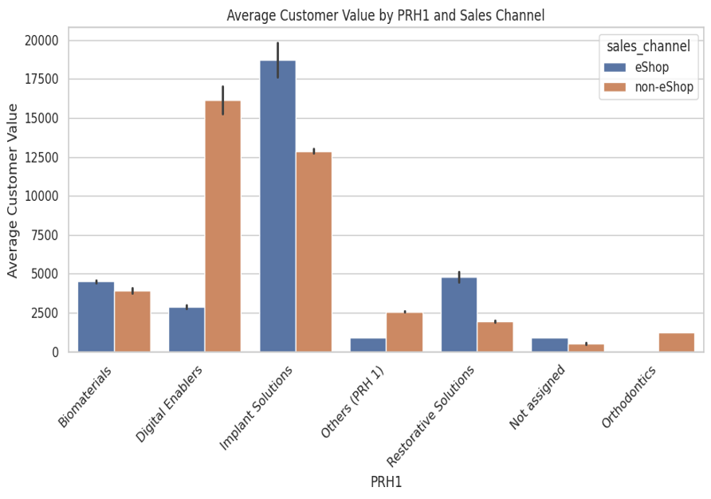

# Customer Segmentation & Predictive Modeling for Product Buying Patterns

This project aims to delve deep into the purchasing behavior of Straumann's customers. The primary objectives include:
### Identification of Buying Patterns: 
Understand and classify the purchasing behavior of customers by analyzing past transaction data. This involves identifying products frequently bought together and determining typical customer preferences.
### Predictive Modeling: 
Develop advanced data models to predict future buying behaviors. These models will not only forecast what products customers are likely to purchase but also suggest complementary products that could be bundled or recommended.
### Actionable Insights for Marketing:
Provide insights that allow the marketing team to target customers more effectively with tailored campaigns. The aim is to boost the success of cross-selling and up-selling strategies by focusing on the right products for the right customers.

## About Sponsor

[Starumann USA LLC ](https://www.straumann.com/us/en/dental-professionals.html), a leading name in esthetic dentistry, is at the forefront of revolutionizing oral health care by providing products that significantly enhance the quality of life. The company believes in the transformative power of a smile, not just as a reflection of physical well-being but as a catalyst for improving self-confidence and unlocking personal potential. In its quest to continuously innovate and serve its customer base better, Straumann is focusing on leveraging data analytics to understand and predict customer behavior more effectively.
## Tech Stack

**Skills** Data cleaning , Data processing ,K-means Clustering
**Programming Language:** Python, pandas 

**Methodologies used :** Clustering , RFM analysis , Cohort analysis, market basket analysis

## Dataset Description 
* order_date
* order_number  
* material_number
* order_material_net_value
* sales_channel    
* PRH1 
* PRH4  
* customer_group
* customer_number 
* region
* DSO_Ind 

The dataset contains 3167194 rows and 11 columns 

## EDA

